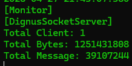
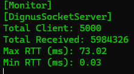
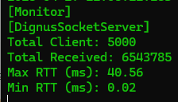

# Dignus Socket Library
## High Performance Server Stress Test Benchmark

## 🔥 Performance Benchmark

Server address: 127.0.0.1
Server port: 1111
Working threads: 1
Working clients: 1
Working messages: 1000
Message size: 32
Seconds to benchmarking: 10

Errors: 0

Total time: 10.001 s
Total data: 1.17 GiB
Total messages: 39,107,244
Data throughput: 119.3 MiB/s
Message throughput: 3,910,724 msg/s

### Test 1 (Cold Start)

- Total Clients: **5,000**
- Test Duration: **30 seconds**
- Total Echo Messages: **5,984,326**
- Peak Throughput: **199,477 RPS**
- Max RTT: **73.02 ms**
- Min RTT: **0.03 ms**

---

### Test 2 (Warm-up)

- Total Clients: **5,000**
- Test Duration: **30 seconds**
- Total Echo Messages: **6,543,785**
- Peak Throughput: **218,126 RPS**
- Max RTT: **40.56 ms**
- Min RTT: **0.02 ms**

## 📷 Test Result Screenshot

### Test 1

### Test 2

## ⚙️ Test Environment

- Network: Localhost (127.0.0.1)
- OS: Windows 11 22H2

## 📚 Dignus Library Structure

> DLL files are located in the `/Dll` directory.

- **Dignus.dll**: Core utilities and framework
- **Dignus.Sockets.dll**: High-performance socket server/client module
- **Dignus.Log.dll**: Lightweight logging system
