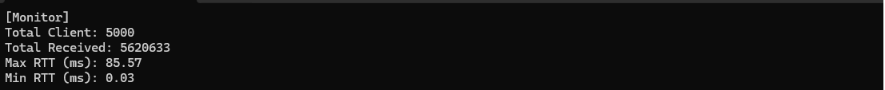
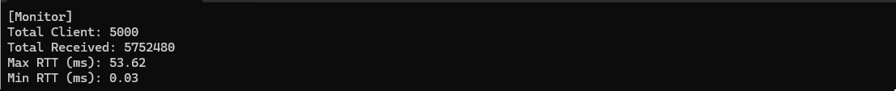

# Dignus Library
## High Performance Server Stress Test Benchmark

## 🔥 Performance Benchmark

### Test 1

- Total Clients: **5,000**
- Test Duration: **30 seconds**
- Total Echo Messages: **5,620,633**
- Peak Throughput: **187,354 RPS**
- Max RTT: **85.57 ms**
- Min RTT: **0.03 ms**

### Test 2

- Total Clients: **5,000**
- Test Duration: **30 seconds**
- Total Echo Messages: **5,752,480**
- Peak Throughput: **191,749 RPS**
- Max RTT: **53.62 ms**
- Min RTT: **0.03 ms**

## 📷 Test Result Screenshot

### Test 1

### Test 2

## ⚙️ Test Environment

- Network: Localhost (127.0.0.1)
- OS: Windows 11 22H2

## 📚 Dignus Library Structure

> DLL files are located in the `/Dll` directory.

- **Dignus.dll**: Core utilities and framework
- **Dignus.Sockets.dll**: High-performance socket server/client module
- **Dignus.Log.dll**: Lightweight logging system
