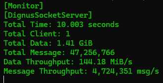

# Dignus Socket Library
## High Performance Server Stress Test Benchmark

## 🔥 Performance Benchmark

- Server address: 127.0.0.1
- Server port: 5000
- Working clients: 1
- Working messages: 1000
- Message size: 32
- Seconds to benchmarking: 10

- Errors: 0
- Total Time: 10.003 seconds
- Total Client: 1
- Total Data: 1.41 GiB
- Total Message: 47,256,766
- Data Throughput: 144.18 MiB/s
- Message Throughput: 4,724,351 msg/s

---

---

👉 Benchmark source: [ServerPerformanceBenchmark on GitHub](https://github.com/EomTaeWook/ServerPerformanceBenchmark)

## 📚 Dignus Library Structure

> DLL files are located in the `/Dll` directory.

- **Dignus.dll**: Core utilities and framework
- **Dignus.Sockets.dll**: High-performance socket server/client module
- **Dignus.Log.dll**: Lightweight logging system
